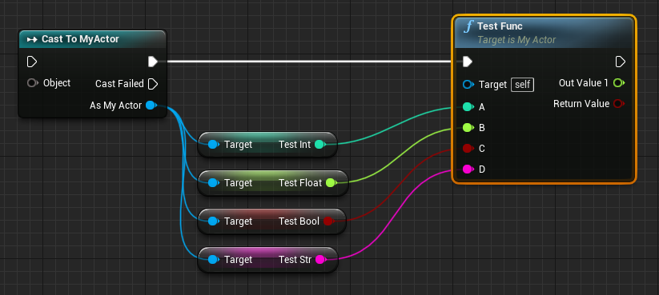
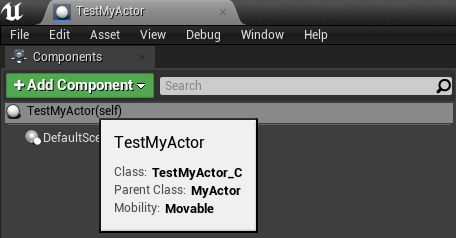

# 什么是Subclassing

Subclassing是指在Python中直接定义UClass的能力。

将Python类直接映射为```UClass```，这个```UClass```就如同在C++中定义的一样，能被蓝图识别、使用、继承。Python类的```类成员变量```会被映射为```UProperty```，```类成员方法```会被映射为```UFunction```。

使用Subclassing，蓝图类和Python类可以相互继承，可以在Python层实现蓝图类的事件（BlueprintEvent），也可以在蓝图中直接调用Python类的方法。

# 一个Subclassing的例子

为了启用Subclassing，在定义Python类的时候需要直接继承UE4类型。

在Python中，可通过如下方法定义一个能被Subclassing系统识别的类：

```python
# MyActor.py
import ue

class MyActor(ue.Actor.Class()):
	'''MyActor继承自AActor::StaticClass()'''

	TestInt = int      # 蓝图IntProperty类型变量
	TestFloat = float  # 蓝图FloatProperty类型变量
	TestBool = bool    # 蓝图BoolProperty类型变量
	TestStr = str      # 蓝图StrProperty类型变量

	def __init__(self):
		'''此方法会在MyActor实例构造（NewObject<MyActor>()）时调用'''
		pass

	@ue.bp_func()
	def ReceiveBeginPlay(self):
		'''此方法覆写了C++中的同名原生方法，会在BeginPlay时调用'''
		pass

	@ue.bp_func((int, float, bool, str), (bool, float))
	def TestFunc(self, a, b, c, d):
		'''此方法可以在蓝图中被调用，具有4个参数，2个返回值'''
		pass
```

要将```MyActor```类型注册至UE4，只需要简单import一下。(建议在on_post_engine_init中或者之前Import此类，从而编辑器可以识别MyActor)

```python
import MyActor
```

随后便可在蓝图中使用该类型：




也可以新建蓝图继承该类型：



# 添加成员变量

在Python类上添加```类成员变量```，将会被识别为蓝图变量。定义语法为：

```python
[成员变量名] = [成员变量类型]
```

具体支持的变量类型详见[类型详解](#类型详解)章节。

注意：
* 以```_```（下划线）开头的成员变量不会暴露给蓝图。
* 目前仅支持新增成员变量，不支持对现有成员变量进行覆盖！

# 添加/覆写成员方法

在Python类上添加```类成员方法```，并使用```@ue.bp_func```装饰器标注，即可为对应蓝图类添加蓝图方法。

```@ue.bp_func```具有如下定义

```python
def bp_func(arg_types=(...), ret_types=(...))
```

其中，```arg_types```用于定义参数类型，```ret_types```用于定义返回值类型。参数和返回值支持的类型详见[类型详解](#类型详解)章节。

对于在C++中标记为```BlueprintImplementableEvent```的UFUNCTION而言，可以在Python中定义同名方法，以达到覆写的目的。

注意：
* 以```_```（下划线）开头的成员方法不会暴露给蓝图。
* 在覆写蓝图方法时，仍需带有```@ue.bp_func```标记，但无需定义参数和返回值类型。

# 类型详解

NEPY目前支持以下Subclassing类型，成员变量的类型标注和成员方法的类型标注是通用的。

## 基础类型

可以直接使用Python中的基础类型来定义蓝图变量类型：

```python
import ue
class MyPythonClass(ue.Object.Class()):
	XXX = int    # 对应IntProperty
	XXX = float  # 对应FloatProperty
	XXX = bool   # 对应BoolProperty
	XXX = long   # 对应Int64Property
	XXX = str    # 对应StrProperty
```

也可以直接使用UE中的Property定义：
```python
import ue
class MyPythonClass(ue.Object.Class()):
	XXX = ue.BoolProperty
	XXX = ue.Int8Property
	XXX = ue.Int16Property
	XXX = ue.IntProperty
	XXX = ue.Int64Property
	XXX = ue.ByteProperty
	XXX = ue.UInt16Property
	XXX = ue.UInt32Property
	XXX = ue.UInt64Property
	XXX = ue.FloatProperty
	XXX = ue.DoubleProperty
	XXX = ue.NameProperty
	XXX = ue.StrProperty
	XXX = ue.TextProperty
```

## 复杂类型

对于已生成静态导出的类型而言，可以通过以下方式进行类型标注：

```python
import ue
class MyPythonClass(ue.Object.Class()):
	SomePawn = ue.Pawn
	SomeVector = ue.Vector
```

对于未生成静态导出，但为引擎内置的类型，可以通过以下方式进行类型标注：

```python
import ue
class MyPythonClass(ue.Object.Class()):
	SomePawn = ue.FindClass('Pawn')
	SomeVector = ue.FindStruct('Vector')
	SomeAxis = ue.FindEnum('EAxis')
```

对于用户自定义的蓝图类、结构、枚举，需要首先从磁盘加载。不太确定这样做有什么副作用，但您也可以通过以下方式进行类型标注：

```python
import ue
class MyPythonClass(ue.Object.Class()):
	SomeObject = ue.LoadClass('/Game/Path/To/My/BP_Class.BP_Class_C')
```

## 集合类型

集合类型包括```数组(list)(TArray)```，```字典(dict)(TMap)```和集合```(set)(TSet)```。用户可以通过以下方式标注集合类型：

```python
import ue
class MyPythonClass(ue.Object.Class()):
	SomeArray = [float] # 一个内容为float的数组
	SomeMap = {str: int} # 一个键为str，值为int的数组
	SomeSet = {ue.Actor} # 一个内容为AActor的集合
```

# Subclassing使用注意事项

## 性能警告

Subclassing的原理是全动态地构造出蓝图类，在调用属性/方法时，性能低于普通静态绑定。

- 从Python端访问Subclasing类成员变量，其性能与从Python端访问普通蓝图变量相当，远低于访问静态导出的C++成员变量。

- 从蓝图端访问Subclassing类成员变量，性能略低于访问普通蓝图变量。

- 从Python端调用Subclassing类方法，性能与调用普通Python方法相当。

- 从蓝图端调用Subclassing类方法，性能低于调用普通蓝图方法。

大体上说，使用Subclassing，除了有Python虚拟机部分的开销外，还额外增加了蓝图虚拟机部分的开销。而使用静态绑定，Python直接与C++交互，跳过了蓝图虚拟机，性能占优。

## 在ue_site中注册类型

使用了Subclassing，意味着普通UE资产也会依赖Python类型。因此，在打包游戏时，也应该从Python层注册Subclassing信息。否则，打包会失败。

```ue_site.py```无论在游戏运行时，还是在打包时（运行Commandlet时）都会加载。因此，应该在```ue_site.py```中import所有的Subclassing类型，以保证打包正常。
