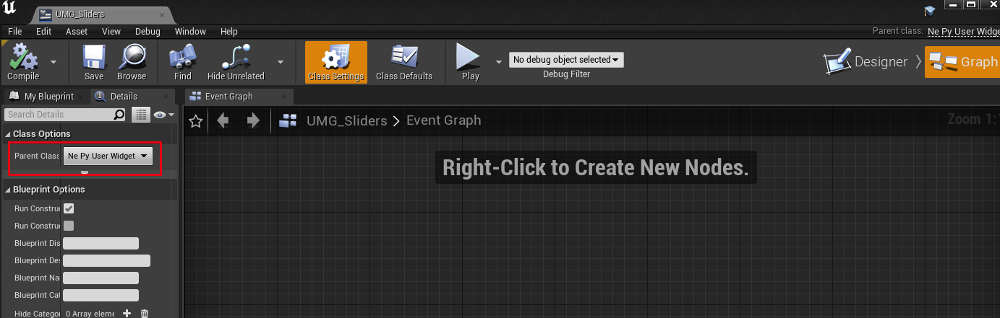

# 简介

此章节将介绍使用NEPY对UE4的UMG框架进行封装的基本思路和相关实现。

# 架构介绍

UI框架包含两个基本的类型，`UIBase`对应UE4中的`UWidget`，是每个UI控件的基类，其中包含一个`uobj`对象，是其对应的UE Widget；`PyUserWidget`对应UE4中的`UUserWidget`，是作为主面板的UI容器，一般会对应一个蓝图资源。

搭建这个框架的目的是为了在实现UI逻辑时，不需要再写额外的C++和蓝图代码，而可以全部使用Python完成。

## 使用流程
1. 在编辑器中创建一个UI蓝图资源，并且将这个蓝图的Class类型设置为`NepyUserWidget`

2. 在python中创建一个新的类型，继承`PyUserWidget`，代表一个UI面板。同时，
    - 指定`UMG_PATH`变量，这个变量内的路径表示这个python类型对应的UI蓝图所在的位置，例如"Folder.UMG_Name"。运行时会根据这个变量，以及`UILibrary`中的`UMG_FILE_UE_PATH`配置，检索对应的UI蓝图。
    - 指定`BIND_WIDGET`变量，这个变量可以指定该UI蓝图内的子面板所对应的python类型。具体可以参见UI示例中的`ParentPanel`类。

3. UI类型中包含若干内置函数，其含义和调用顺序如下：
    - `__init__()`，Python自身的构造函数，会在构造UI对象时最先调用
    - `construct()`，完成UI控件绑定后调用的构造函数，在其中可以初始化UI相关的逻辑。控件绑定的详细内容稍后也会提到。
    - `init()`，初始化函数，此时UI已经全部构造完成。
    - `on_native_tick()`，每帧调用的tick函数。
    - `destruct()`，UI销毁时调用的析构函数，此时UI对象仍然有效，可以做一些逻辑层面的清理工作。
    其中，除了`on_native_tick()`函数外，均需要调用父类的super函数。

## 控件绑定
UI框架实现了一个简单的控件绑定功能，控件绑定的含义是，对于每个UI蓝图中的控件，在python中可以直接通过类似`panel.button`的方式简单访问。目前，对于普通的UI控件，封装的python类型是`UIBase`，对于蓝图中包含的子面板，封装的类型是`UUserWidget`。